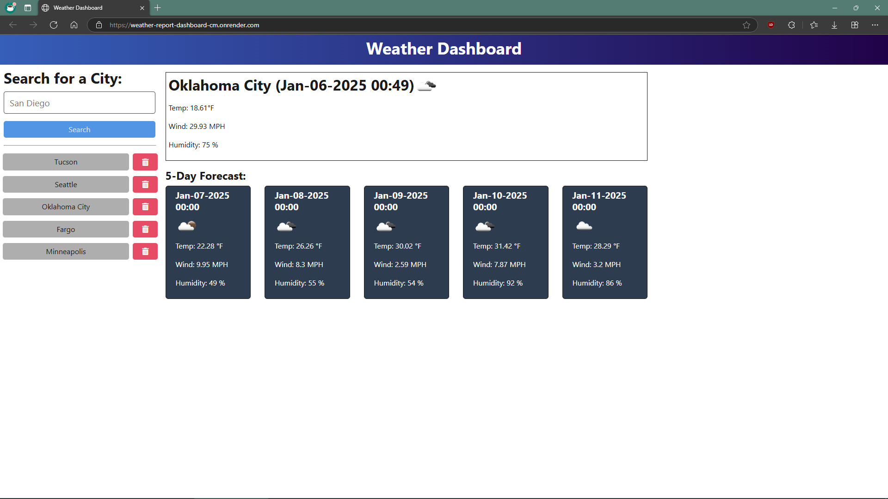

# Weather-Report-Dashboard-CM

## Description

A web-based application where the user can view the weather outlook for user-specified cities. Previous searches are saved in the search history.

## Table of Contents

- [Installation](#installation)
- [Usage](#usage)
- [Contributing](#contributing)
- [Tests](#tests)
- [Questions](#questions)
- [License](#license)

## Installation

Use your favorite software package manager, such as Node Package Manager, to install the dependency files. The pre-written script "npm run start" can be executed by Node Package Manager from the top level directory to start the web service.

## Usage

Enter the name of a city from the United States in the search bar and then click the on-screen 'Search' button. Previously viewed cities can be recalled by pressing the appropriate button underneath the 'Search' button. Follow the link below to view the deployed web app.

[https://weather-report-dashboard-cm.onrender.com](https://weather-report-dashboard-cm.onrender.com)

## Contributing

Contact Christopher Makousky for inqueries about making contributions to this project.

## Tests

Follow the on-screen prompts to test the client features. Use your favorite API development platform, such as Insomnia, to test the server routes.

    GIVEN a weather dashboard with form inputs

    WHEN I search for a city

    THEN I am presented with current and future conditions for that city, and that city is added to the search history

    WHEN I view current weather conditions for that city

    THEN I am presented with the city name, the date, an icon representation of weather conditions, a description of the weather for the icon's alt tag, the temperature, the humidity, and the wind speed

    WHEN I view future weather conditions for that city

    THEN I am presented with a 5-day forecast that displays the date, an icon representation of weather conditions, the temperature, the wind speed, and the humidity

    WHEN I click on a city in the search history

    THEN I am again presented with current and future conditions for that city

## Questions

https://github.com/CMakousky

christopher.makousky@gmail.com

## License

MIT License